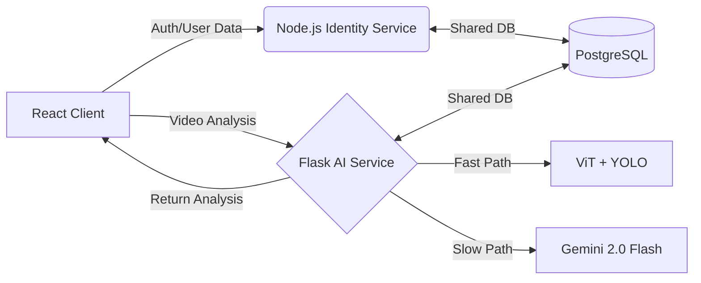

# ThreatSense AI 🚨
### Intelligent Disaster Analysis & Response System
**Real-time disaster classification and human detection using Dual-Agent AI (Vision + LLM).**

[](https://react.dev/)
[](https://nodejs.org/)
[](https://flask.palletsprojects.com/)
[](https://www.postgresql.org/)
[](https://deepmind.google/technologies/gemini/)

---

## 🚀 Overview
**ThreatSense AI** is a cutting-edge disaster management platform. It processes live video feeds to identify disasters (Wildfire, Flood, Earthquake) and quantify human presence to prioritize rescue operations.

It features a **Dual-Agent Architecture**:
1.  **Fast Vision Agent**: Uses **ViT (Vision Transformer)** and **YOLOv8** for sub-second, real-time detection.
2.  **Thinking Agent (Gemini 2.0)**: A fallback integration that analyzes ambiguous scenes to provide high-confidence verification and detailed reports.

---

## 🏗 System Architecture

The application follows a **Microservices Architecture** with a shared Polyglot Persistence layer:



### 🧠 Dual-Agent Logic
| Agent | Role | Models | Trigger Condition |
| --- | --- | --- | --- |
| **Vision Agent** | rapid triage | `ViT-base-patch16` + `YOLOv8n` | Always active (Default) |
| **Thinking Agent** | Complex reasoning | `Google Gemini 2.0 Flash` | Triggered if Vision Agent is uncertain ("Normal") |

---

## ⚡ Quick Start (Local)

We run the application services locally for best performance, using a lightweight Docker container for the database.

**Prerequisites**
*   Node.js & npm
*   Python 3.10+
*   Docker (only for Database)

**Setup & Run**

```bash
# 1. Clone the repository
git clone https://github.com/harshit-singhania/ThreatSenseAI.git

# 2. Start Everything
# This script starts the Postgres container and launches Node/Flask/React locally.
./start_local.sh
```

*   **Frontend**: `http://localhost:5173`
*   **Auth Service**: `http://localhost:8000`
*   **AI Service**: `http://localhost:7001`

---

## 🧪 Tech Stack

*   **Frontend:** React, TailwindCSS, Framer Motion
*   **Identity Service:** Node.js, Express, `pg` (node-postgres)
*   **AI Service:** Python, Flask, SQLAlchemy, PyTorch, Transformers, YOLOv8
*   **Database:** PostgreSQL 15
*   **External AI:** Google Gemini API

---

## 📄 License

MIT License.

