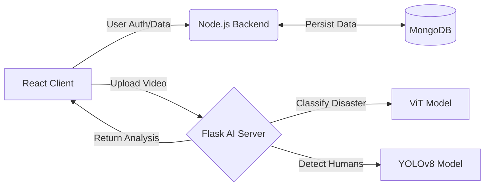

# ThreatSense AI 🚨
### Intelligent Disaster Analysis & Response System
**Real-time disaster classification and human detection using Hybrid AI Architectures (ViT + YOLOv8).**

[](https://react.dev/)
[](https://nodejs.org/)
[](https://flask.palletsprojects.com/)
[](https://www.docker.com/)
[](https://docs.ultralytics.com/)

---

## 🚀 Overview
**ThreatSense AI** is a disaster management platform designed to automate the assessment of natural calamities. By processing live video feeds (MP4, AVI, MOV), it identifies disaster types and quantifies human presence in danger zones to prioritize rescue operations.

The system utilizes a **Microservices Architecture**, separating the user management logic (Node.js) from the compute-intensive AI inference engine (Python/Flask).

---

## 🏗 System Architecture

The application is composed of three decoupled services communicating via REST APIs:



### 🧠 AI Capabilities

| Component | Model | Function |
| --- | --- | --- |
| **Disaster Classifier** | `Vision Transformer (ViT)` | Classifies scenarios into **Wildfire**, **Flood**, or **Earthquake** using `google/vit-base-patch16-224`. |
| **Human Detection** | `YOLOv8` (Ultralytics) | Real-time object detection to count individuals trapped in the footage. |

---

## ⚡ Quick Start (Docker)

The fastest way to deploy the full stack is via Docker Compose.

**Prerequisites**

* Docker Desktop installed and running.

**Deploy**

```bash
# 1. Clone the repository
git clone [https://github.com/harshit-singhania/ThreatSenseAI.git](https://github.com/harshit-singhania/ThreatSenseAI.git)

# 2. Build and Run Container Swarm
docker compose up --build

```

*Access the dashboard at `http://localhost:5173*`

---

## 🛠 Manual Installation

If you prefer to run services individually for development:

### 1. Backend Service (Node.js)

Handles user authentication and database operations.

```bash
cd BackEnd
npm install
# Create .env with MONGODB_URI and PORT=8000
npm run dev

```

### 2. AI Inference Server (Python)

Hosts the ViT and YOLOv8 models.

```bash
cd FlaskServer
pip install -r requirements.txt
python app.py
# Runs on Port 7001

```

### 3. Frontend Client (React)

User interface for uploading videos and viewing analytics.

```bash
cd FrontEnd
npm install
npm run dev
# Accessible at http://localhost:5173

```

---

## 🧪 Tech Stack

* **Frontend:** React, TailwindCSS, Framer Motion
* **Backend:** Node.js, Express, MongoDB
* **AI/ML:** Python, Flask, PyTorch, Transformers (Hugging Face), OpenCV, YOLOv8
* **DevOps:** Docker, Docker Compose, Nginx

---

## 📄 License

MIT License.

